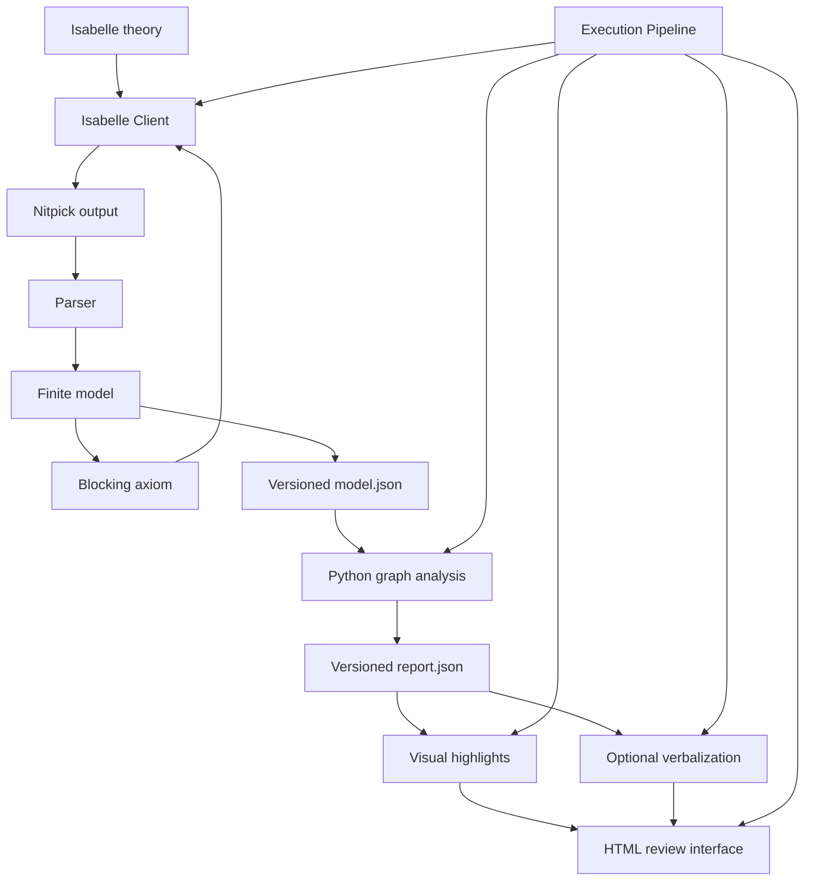
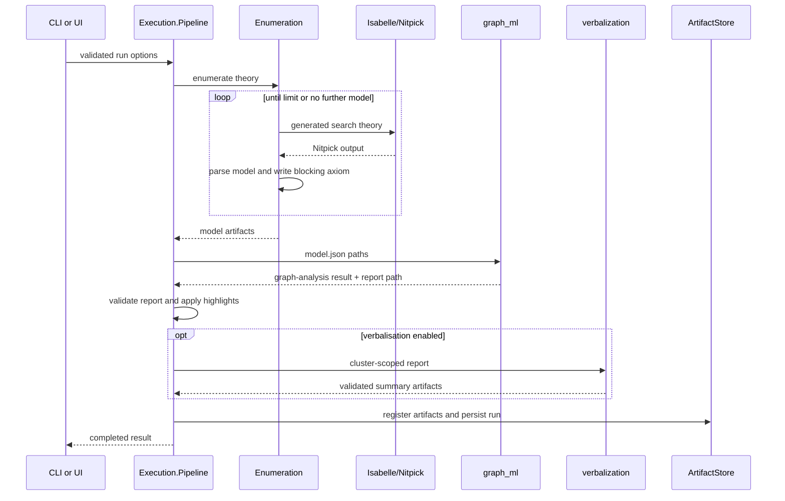

# Architecture

## Overview

ModalLens is a mixed Elixir–Python research prototype with Isabelle/HOL as its symbolic model generator.



The public project identity is ModalLens. The current internal Elixir namespace may remain `Src.*` until a separate mechanical namespace migration is performed.

## Responsibility boundaries

### `Src.Core`

Owns logical data and pure transformations:

- SDL and DDL model structures;
- Nitpick parsing;
- designated-world semantics;
- model export;
- blocking-axiom construction;
- parser warnings.

This layer does not launch Isabelle, Python, or the UI.

### `Src.Isabelle`

Owns Isabelle execution adapters:

- local process execution;
- generated theory and ROOT handling;
- optional HPC execution through HPCConnect;
- validation of theory paths and backend inputs.

The client returns explicit command metadata and output paths to the enumeration layer.

### `Src.Enumeration`

Owns iterative finite-model search.

```text
Src.Enumeration
├── SearchTheory
│   └── generates numbered Isabelle search theories
└── Iteration
    ├── invokes Isabelle/Nitpick
    ├── detects terminal no-model results
    ├── parses one model
    ├── writes model artifacts
    └── generates one blocking axiom
```

`Src.Enumeration` owns the recursive loop and stops when:

- the configured model limit is reached;
- the consistency-check mode finds its first model;
- Nitpick finds no further result;
- an execution or parsing error occurs.

### `Src.Execution`

Owns the canonical application workflow.

```text
Execution.Options
→ Execution.Run
→ Execution.Pipeline
→ Execution.ArtifactStore
```

Responsibilities:

- canonical run parameters;
- run lifecycle and metrics;
- model enumeration;
- Python analysis launch;
- report validation;
- cluster construction;
- highlighted graph rendering;
- optional cluster verbalisation;
- artifact registration;
- final `run.json` persistence.

CLI and UI code delegate to this pipeline instead of implementing alternative analysis paths.

### `Src.Explanation.Visual`

Owns presentation of structural evidence:

- palette definitions and score normalisation;
- world and edge highlight structures;
- DOT/SVG generation;
- TikZ/PDF generation.

Highlights remain data even when graph rendering is disabled.

### `Src.Explanation.Verbal`

Owns the Elixir side of verbalisation:

- validated request construction;
- request artifact writing;
- Python launcher invocation;
- subprocess response decoding.

### `graph_ml`

Owns deterministic graph analysis:

- model JSON loading and validation;
- conversion to directed NetworkX graphs;
- raw, Weisfeiler–Lehman, and graphlet features;
- sparse feature matrices;
- agglomerative clustering;
- graphlet occurrence and contrast analysis;
- report and highlight construction.

The durable result is `report.json`. Subprocess stdout contains only minimal execution metadata.

### `verbalization`

Owns optional language-model explanation:

- deterministic fact extraction;
- canonical fact hashing;
- prompt construction;
- backend abstraction;
- Transformers and Ollama adapters;
- strict summary validation;
- Markdown rendering;
- provenance recording.

### `Src.Interface`

Owns user-facing entry points:

- command-line argument parsing;
- canonical option construction;
- HTML session, view, and page generation.

It does not own analysis logic.

## Canonical control flow



## Cross-language boundary

The architecture deliberately avoids passing analysis data only through stdout.

```text
Elixir → request/model JSON → Python
Python → report/summary/provenance JSON → Elixir
```

Every durable boundary has:

- a schema identifier;
- a string schema version;
- required-field validation;
- explicit error handling.

See [`artifact-contracts.md`](artifact-contracts.md).

## Extension points

### Candidate refinement

A future refinement component should consume:

- characteristic patterns;
- cluster support and contrast;
- representative occurrences;
- model and theory provenance.

It should produce candidate axioms as a new versioned artifact and must not be hidden inside the language-model layer.

### Higher-order modal logics

Support for additional logics should extend:

- the model representation;
- parser rules;
- designated-world semantics;
- model export;
- blocking-axiom generation.

The execution and artifact layers should remain logic-agnostic where possible.

### HPC execution

HPC adapters should preserve the same `Execution.Pipeline` and artifact contracts. Remote execution is an adapter concern, not a second workflow.
