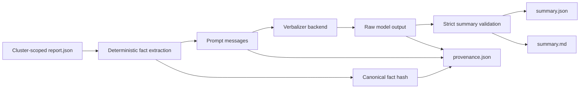

# Verbalisation

## Role

Verbalisation is an optional explanation layer. It does not discover models, compute clusters, mine patterns, or create normative conclusions.

Its input is a validated analysis report. Its purpose is to express recorded evidence in readable language while preserving enough provenance to audit the result.

## Data flow



## Deterministic facts

`verbalization/facts.py` extracts a backend-independent fact collection from the report.

The fact layer:

- includes only fields already present in the report;
- assigns stable fact identifiers and source paths;
- sorts facts deterministically;
- excludes unrestricted source-theory text and volatile metadata;
- serialises canonically for SHA-256 hashing.

The language model should not be asked to infer new logical facts outside this collection.

## Prompt construction

`verbalization/prompt.py` converts the facts into backend messages. Prompt requirements should state that:

- the output must follow the required JSON structure;
- claims must be grounded in supplied fact identifiers;
- clusters and patterns are diagnostic evidence;
- no new norms or axioms are to be invented;
- uncertainty and limitations must be preserved.

Prompt text is part of the reproducibility boundary and is hashed through the final message collection.

## Backends

The current backend factory supports:

- `transformers`
- `ollama`

The Elixir request records:

- backend;
- model identifier;
- seed;
- maximum new tokens;
- backend-specific options.

The currently considered small models include:

- `HuggingFaceTB/SmolLM3-3B`
- `Qwen3-4B-Instruct-2507`
- `microsoft/Phi-4-mini-instruct`

Model availability and exact identifiers should be verified in the experiment environment before publication.

## Output validation

The raw model response is not accepted directly. It must parse as one JSON object and satisfy the summary contract.

The validated content contains:

- an overview;
- cluster summaries;
- evidence references;
- notable pattern references;
- limitations.

Malformed JSON, missing required fields, invalid cluster identifiers, or invalid evidence formats cause the verbalisation step to fail.

## Artifacts

For each verbalised cluster:

```text
verbalization/cluster-N/
├── verbalization_request.json
├── report.json
├── raw_output.txt
├── summary.json
├── summary.md
└── provenance.json
```

`report.json` is cluster-scoped: unrelated clusters and their highlights should not be sent to the backend.

## Reproducibility

The default request uses:

```text
seed = 42
max_new_tokens = 768
```

The provenance artifact records hashes of:

- canonical verbalisation facts;
- prompt messages;
- raw model output.

A fixed seed does not guarantee byte-identical output across all hardware, library, quantisation, or backend configurations. Evaluation records should therefore include:

- exact model revision;
- backend and library versions;
- device and numerical precision;
- generation parameters;
- raw output and provenance files.

## Interpretation

A verbal summary is a convenience representation. The authoritative evidence remains:

1. `report.json`;
2. the model artifacts referenced by the report;
3. the deterministic facts derived from the report;
4. the raw output and provenance.

Reviewers should be able to disable verbalisation entirely and still inspect the complete symbolic and graph-analysis workflow.
